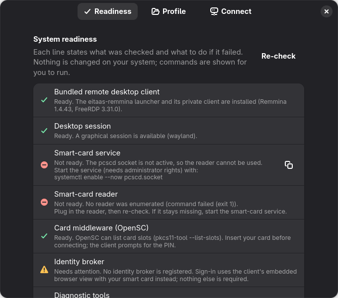
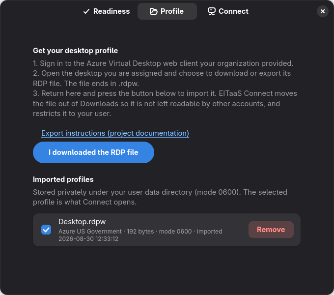
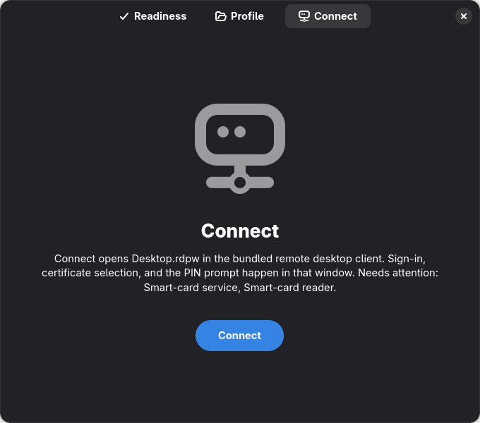

# EITaaS-Linux

Community tooling for connecting to an Azure Virtual Desktop (AVD) workspace
from Linux with Common Access Card (CAC) redirection through a bundled
one-shot Remmina/FreeRDP client.

The project began as documentation for the Sonic Boom pilot. It is independent
community work and is not endorsed by Microsoft, the Department of Defense,
the Department of the Air Force, or the operators of Enterprise IT as a
Service. See `NOTICE` for the complete statement.

> [!WARNING]
> This repository is under active development. Microsoft does not provide a
> supported native Linux Windows App client. Confirm that your organization
> permits FreeRDP before using it.

## Why this exists

The AVD web client works on Linux but does not redirect smart cards. Smart-card
redirection is needed for CAC-authenticated sites and signing applications
inside a remote session. EITaaS-Linux checks the local system and starts the
bundled `eitaas-remmina` client with a profile manually exported from the AVD
web client.

## Security defaults

- Server certificate verification remains enabled. The project does not use a
  certificate-bypass switch in its normal connection path.
- No all-users pcsc-lite or polkit override is installed or recommended.
- The tool never asks for or records a CAC PIN.
- Real `.rdp` and `.rdpw` profiles, OAuth callbacks, keys, certificates, packet
  captures, and local agent state are excluded from Git.
- Connection profiles should be owned by the current user and mode `0600`.
- Clipboard redirection follows the connection profile; the launcher does not
  override it. The bundled client honors the profile's `redirectclipboard`
  field through Remmina's RDPW importer, and a profile that omits the field
  gets the RDP default (enabled). This is by design: the exported profile is
  the policy source. The field is not among the keys forwarded to FreeRDP's
  native profile parser (allowlist in `packaging/remmina/0006-*.patch`).

On a shared computer, another process running as the same Linux account may be
able to access an inserted smart card. Polkit cannot isolate mutually
untrusted processes belonging to one user. Remove the CAC when it is not in use.

## Current workflow

1. Sign in to the authorized Azure US Government web client supplied by your
   organization and manually export the desktop `.rdpw` profile. Microsoft does
   not document a supported public API for automating this export.
2. Import it into the private profile store:

   ```bash
   eitaas profile import Desktop.rdpw
   ```

   This moves the file out of the download directory into
   `$XDG_DATA_HOME/eitaas-remmina/profiles/`, restricts it to your user
   (mode `0600`), and makes it the default profile for `eitaas connect`.
   `eitaas profile list`, `select NAME`, and `remove NAME` manage the store.
   The manual alternative still works: `chmod 600 Desktop.rdpw` and pass the
   explicit path to `eitaas connect Desktop.rdpw`.

3. Install the single `eitaas-linux` package for your distribution. It carries
   the bundled one-shot Remmina/FreeRDP client, the `eitaas` command-line
   helper, and the EITaaS Connect graphical helper, so one command installs
   everything:

   ```bash
   # Fedora
   sudo dnf install ./eitaas-linux-<version>.x86_64.rpm

   # Debian / Ubuntu
   sudo apt install ./eitaas-linux_<version>_amd64.deb

   # Arch Linux
   sudo pacman -U ./eitaas-linux-<version>-x86_64.pkg.tar.zst
   ```

   Upgrading from the earlier split packages needs no extra step: the new
   package obsoletes/replaces `eitaas-remmina` and `eitaas-linux-gui`. Build
   the artifacts yourself with `scripts/build-rpm.sh`, `scripts/build-deb.sh`,
   or `scripts/build-arch.sh`. These are not official distribution or AUR
   packages.

4. Diagnose the system:

   ```bash
   eitaas doctor
   eitaas smartcard status
   eitaas inspect-profile Desktop.rdpw
   ```

5. Connect with the isolated one-shot GovCloud client:

   ```bash
   eitaas-remmina Desktop.rdpw
   ```

   `eitaas connect` with no argument uses the imported default profile and
   fails closed when none has been imported. `eitaas connect Desktop.rdpw`
   uses an explicit path instead. Either form is a thin wrapper: it validates
   the profile (ownership, mode `0600`, size, extension) and then runs
   `eitaas-remmina PROFILE.rdpw` with no other arguments.

The EITaaS suite combines the `eitaas` setup/diagnostic tool with a pinned,
privately installed Remmina and FreeRDP pair. It does not replace the system
Remmina installation, and it does not provide an enhanced connection-manager
mode. The exact upstream versions and downstream CAC/GovCloud patches are
recorded in `packaging/remmina/sources.json` and shipped with corresponding
source.

Do not publish, attach, or commit the exported profile. Treat it as
user/resource-specific connection material even when it does not contain a
password.

## Graphical helper

The `eitaas-linux` package installs **EITaaS Connect** (`eitaas-gui`), a
GTK 4/Libadwaita window with three pages:

- **Readiness** shows the `eitaas doctor` result as plain-language rows
  (bundled client, desktop session, smart-card service, reader, card
  middleware, diagnostic tools) with a Re-check button.
- **Profile** walks through the export in six numbered steps: pick the web
  client for your cloud (Azure US Government by default, or Azure commercial)
  and press "Open web client" to open it in your browser; sign in with your
  organization account (the browser may ask for your smart card (PIV)
  certificate and PIN); click the settings cog in the top right; choose
  "Download the rdp file"; click your desktop, which saves a file such as
  `Desktop.rdpw` to Downloads; then press "I downloaded the RDP file" and pick
  it. The import is the same move-and-restrict as `eitaas profile import`. A
  "Why do I need this file?" expander explains that the `.rdpw` is a signed,
  password-free description of your workspace and why it is moved out of
  Downloads. Imported profiles are listed with a selector for the one Connect
  uses and a Remove action.
- **Connect** starts `eitaas-remmina` with the selected profile, shows the
  phase with a Cancel button while the client runs, and shows redacted errors
  in place.

The first run opens on Readiness. Once the checks have passed and a profile is
imported, later starts open directly on the Connect page while the checks
re-run in the background (recorded as a small timestamp-and-hash marker under
`$XDG_STATE_HOME/eitaas-gui/`, mode 0600). If a check that passed before now
fails, a dialog names it; dismissing the dialog switches to the Readiness
page. Connect is disabled only when the launcher or its client binary is
missing, never on warnings.

Double-clicking a `.rdpw` file in the file manager (MIME type
`application/x-eitaas-rdpw`) opens the Profile page with an "Import
FILE into your private profile store?" banner. Nothing is imported or
connected until you press Import and then Connect.

The screenshots below were captured with a synthetic readiness report and
the synthetic test fixture; they contain no real profile, host, or account.





The helper keeps the ADR-0002 boundary: it is not a connection manager,
sign-in and the smart card (PIV) PIN prompt happen in the Remmina window, and it runs no
privileged commands. Fixes such as `systemctl enable --now pcscd.socket` are
shown with a copy button for you to run yourself.

## Troubleshooting

Every connection started by `eitaas connect` or EITaaS Connect writes the
client's output, redacted line by line (tokens, `key=value` secrets, and URL
query values are replaced), to
`$XDG_STATE_HOME/eitaas-remmina/logs/session-<timestamp>-<pid>.log`
(`~/.local/state/...` by default; directory 0700, files 0600, about 2 MiB
each, the newest five kept). The last line is `exit=<code>`.

- **Graphical helper:** when the client exits with a non-zero status the
  Connect page shows the last `smartcard-auth:` reason-code and Remmina
  warning lines from that log together with the log's path, and a
  "Copy diagnostic log" button places the whole redacted log on the
  clipboard for a support request.
- **Command line:** `eitaas doctor --json` reports `latest_session_log`.
  To watch the stages live on a terminal, run the bundled client directly:
  `G_MESSAGES_DEBUG=remmina eitaas-remmina PROFILE.rdpw` (the launcher
  sets that default itself, so plain `eitaas-remmina PROFILE.rdpw` also
  prints them). Only counts, reason codes, and the Microsoft sign-in host
  are logged; certificate labels, PKCS #11 URIs, PINs, and tokens never
  are. Remmina itself also appends its debug lines to
  `$TMPDIR/remmina_log_file.log` (upstream behaviour, not redacted by the
  helper). The session-log header counts processes whose command name is
  `remmina` — any Remmina binary, not only the bundled one — because a
  running distribution Remmina is a known way to lose the connection
  request.

  The stable reason codes (`smartcard-auth: <code>`), identical in the
  downstream and upstream trees:

| Code | Level | Meaning |
|---|---|---|
| `challenge-received (scheme= unverified-host= port= proxy= retry= application= remote=)` | debug | WebKit asked for a client certificate or PIN; the host is the one WebKit reported, before validation |
| `challenge-accepted (host=)` | debug | The challenge origin matched the verified sign-in authority |
| `origin-rejected (reason)` | warning | Challenge refused: `proxy-challenge`, `no-authentication-host`, `no-security-origin`, `origin-not-https`, `origin-host-mismatch`, `host-not-authority`, `origin-port` |
| `discovery-tool-missing: …` | warning | `p11tool` is not installed (package `gnutls-utils`/`gnutls-bin`); the dialog names the package |
| `discovery-start (tool=)` | debug | `p11tool` enumeration started on a worker thread |
| `discovery-token-skipped-trust (count=)` | debug | p11-kit trust tokens (`model=p11-kit-trust`) skipped without a subprocess |
| `discovery-token-empty (count= last-exit=)` | debug | Tokens where `p11tool --list-certs` printed no URL and exited non-zero (no certificate on that token) |
| `discovery-finished (tokens= certificates= label-filter kept= dropped=)` | debug | Enumeration done; counts only (`label-filter` is downstream-only) |
| `discovery-busy` | warning | Another discovery was still running |
| `discovery-empty: …` | warning | No selectable certificate; the "No usable smart-card authentication certificates" dialog |
| `discovery-timeout` / `discovery-error: …` | warning | `p11tool` deadline (15 s) or failure (token listing failed, output/URI/count limits, malformed output) |
| `discovery-cancelled (user|window-closed|error-after-close)` / `discovery-result-discarded` | warning | Discovery abandoned; the one-shot client then quits (`oneshot-quit`) |
| `certificate-selected (index= of )` / `certificate-submitted (host=)` | debug | Choice made and presented to WebKit |
| `selection-cancelled (user|window-closed)` | warning | Certificate dialog dismissed |
| `load-start` / `load-finished` | debug | `GTlsCertificate` load off the GTK thread |
| `load-timeout` / `load-error (domain/code: message)` / `load-cancelled` / `load-result-discarded` | warning / debug | Load outcome; error text is cut before any `pkcs11:` URI |
| `pin-requested (host= retry=)` / `pin-submitted (host=)` | debug | PIN prompt shown and answered (the PIN itself is never logged) |
| `pin-rejected (reason)` | warning | `origin-rejected`, `no-certificate-transaction`, `transaction-expired`, `transaction-host-mismatch`, `pin-already-submitted` |
| `pin-cancelled (user|window-closed|transaction-cleared)` | warning | PIN dialog dismissed |
| `oneshot-quit (application=)` | debug | The one-shot client is quitting after a cancelled discovery |

  The bundled client also logs the Azure Virtual Desktop ARM gateway phase
  with an `avd-arm:` prefix, identical in the downstream and upstream trees:

| Code | Level | Meaning |
|---|---|---|
| `avd-arm: response-timeout-ms=60000` | debug | The profile set no timeout, so the wait for the ARM gateway's connection response was raised from FreeRDP's 15 s default to 60 s (the request is not idempotent and is never re-sent) |

  The launcher does **not** raise FreeRDP's own log level: at `WLOG_LEVEL=DEBUG`
  FreeRDP's `com.freerdp.utils.http` logger writes the whole OAuth token
  request body and the whole token-endpoint response (access, refresh, and id
  tokens) to the log. The evidence a timeout needs is already emitted at
  WinPR's default level — `timeout [<n>ms] exceeded` at ERROR from
  `com.freerdp.core.gateway.http` — so no `WLOG_LEVEL`/`WLOG_FILTER` export is
  set. Session-log lines are redacted before they are written (JWTs, `Bearer`
  values in any casing, quoted-JSON token fields, `Set-Cookie`/`ARRAffinity`
  cookie values, sensitive `key=value` pairs — including camelCase compounds
  such as `redirectedAuthBlob` and `RedirectionGuid` — and URL query values).
  FreeRDP logs the Azure `ARRAffinity`/`ARRAffinitySameSite` routing cookies at
  INFO level in `libfreerdp/core/gateway/wst.c`, so those values are redacted
  in the session log rather than suppressed at the source; no `WLOG_FILTER` or
  bundled FreeRDP patch is used for them.

  **Older logs are not cleaned retroactively.** Session logs written by earlier
  builds — the `eitaas-linux` 0.1.x CLI and the split-package installs that
  preceded it, together with bundle releases up to `1.4.43+eitaas0.15` — may
  still contain unredacted Azure `ARRAffinity` routing cookies; the cookie
  rules ship in the `eitaas-linux` 0.2.x package. They are load-balancer
  routing values, not credentials, but they are server-issued and
  session-scoped: review a log before attaching it to a support request, or
  delete `$XDG_STATE_HOME/eitaas-remmina/logs/` and let the next connection
  recreate it.

## Bundled client and desktop support

Connections use only the bundled `eitaas-remmina` package: Remmina and
FreeRDP 3 built from the pins in `packaging/remmina/sources.json` with AAD and
PC/SC support, installed under a private prefix. Distribution FreeRDP or
Remmina packages are neither required nor used, so distribution FreeRDP
versions (for example FreeRDP 2 on Ubuntu 22.04) no longer determine support;
see `docs/supported-platforms.md` for the packaging and hardware status.

Authentication uses the embedded CAC WebView; the bundle is built without
SSO-MIB, so no Microsoft Identity Broker is used or probed (#77). The Remmina
patches require the FreeRDP 3.16 settings API and are tested with the pinned
FreeRDP 3.30.x line.
Endpoint allowlisting, the RDPW native-settings allowlist, and refusal of
FreeRDP's terminal URL/callback fallback are enforced inside the bundled client
by the Remmina patches (see #51 and #58), not by the Python tool. Do not capture
OAuth callbacks with browser developer tools or paste them into a terminal.

The connection profile supplies the signed resource, tenant, and endpoint
settings; `eitaas inspect-profile` classifies only allowlisted endpoint
suffixes and rejects mixed or unknown clouds. Nothing modifies the signed
profile.

The `doctor` command reports whether `eitaas-remmina` is on `PATH`, whether
the private client binary is installed, the pinned Remmina/FreeRDP versions
from the installed `sources.json`, and the PC/SC and smart-card tool status.

## Smart-card permissions

First use your distribution's default pcsc-lite policy. Do not run smart-card
tests with `sudo`. If access is denied, diagnose the daemon, socket, session,
reader, and middleware separately before changing authorization policy.

EITaaS-Linux does not install a policy override. A future optional policy must
use exact action identifiers, a dedicated group, and active local sessions; it
must never authorize every account or inactive sessions.

## Certificates

DoD PKI trust is separate from AVD gateway certificate verification. Never work
around an AVD certificate error by disabling verification.

Certificate tooling will use official HTTPS sources, show fingerprints, keep
self-signed trust anchors distinct from intermediates, and require explicit
confirmation before changing a user or system trust store. Package installation
will not download or trust certificates automatically.

## Licensing

Project code is licensed under the MIT License. FreeRDP, OpenSC, pcsc-lite,
distribution packages, certificates, documentation, services, and trademarks
remain subject to their respective terms. See `LICENSE` and `NOTICE`.

Release candidates include SHA-256 manifests and, for approved tag builds,
keyless GitHub provenance attestations. The release signing and verification
procedure is documented in `docs/release-signing.md`.

## Frontends

The CLI and the GTK 4/Libadwaita helper share one presentation-neutral
application API (`docs/application-api.md`). The interaction and accessibility
specification for the helper is documented under `docs/frontend/`. The
graphical design uses original EITaaS-Linux branding; it does not copy or
impersonate Windows App.
